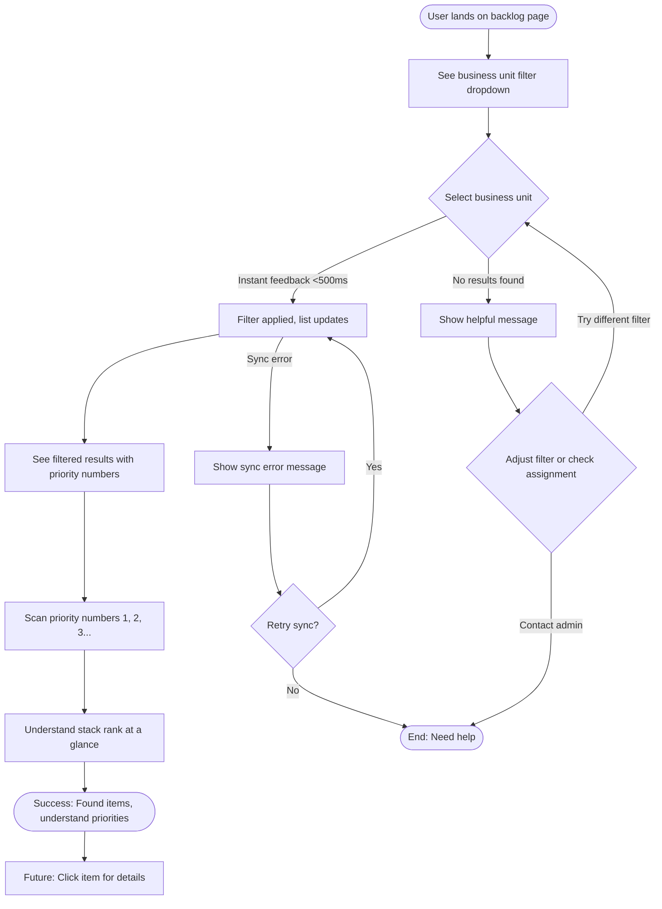
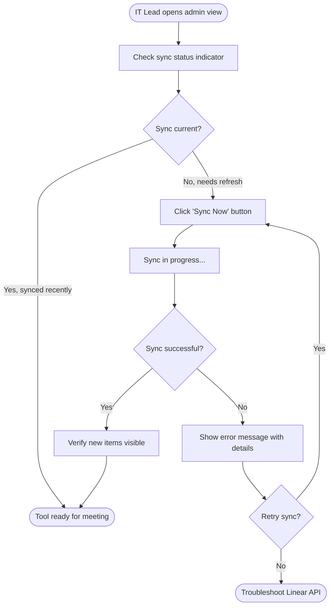

# UX Design Specification Shareable Linear Backlog

**Author:** Rhunnicutt
**Date:** 2026-02-05

---

<!-- UX design content will be appended sequentially through collaborative workflow steps -->

## Executive Summary

### Project Vision

Shareable Linear Backlog transforms IT-business communication from reactive/manual (Excel exports, status emails) to proactive/automated (always-current web interface). This web application provides business stakeholders (VPs/SVPs) with self-service visibility into IT backlog through Linear GraphQL API integration, eliminating the need for Excel exports and manual status communication. The product serves as the first tool at Vixxo to bridge the visibility gap between IT and business stakeholders, providing Linear backlog access without Linear complexity or license costs.

### Target Users

**Primary Users:** VPs/SVPs of Operations, Finance, and other business units who are non-technical business users. They need self-service access to IT backlog information to make prioritization decisions and answer executive questions without depending on IT for manual reports.

**Secondary Users:** IT team members who update Linear (which feeds the tool). Their workflow remains in Linear, and updates automatically sync to the business-facing tool.

**Admin Users:** IT Lead who manages the tool, syncs data, and approves user access. They need admin controls for user management and sync operations.

### Key Design Challenges

1. **Complexity Reduction:** Making Linear's technical backlog data accessible and understandable to non-technical business executives. The interface must hide technical complexity while maintaining data accuracy and presenting information in a scannable, executive-friendly format.

2. **Performance & Responsiveness:** Meeting strict performance targets (page loads <2s, filtering <500ms, interactions <100ms) while handling potentially large datasets from Linear. Users need immediate feedback and smooth interactions to maintain confidence in the tool.

3. **Clarity & Scannability:** Enabling users to find relevant items in <30 seconds and understand stack rank/priority at a glance. The interface must support quick scanning and intuitive filtering without requiring training.

### Design Opportunities

1. **Visual Priority Hierarchy:** Creating clear, intuitive stack rank visualization that helps business users understand priority order immediately. Future Value/Effort matrix visualization (Phase 2) will provide business-friendly prioritization tool.

2. **Meeting-Integrated Workflow:** Designing for both individual asynchronous review and collaborative meeting scenarios. The interface must support VP prep work and group decision-making during bi-weekly prioritization meetings.

3. **Self-Service Empowerment:** Building an intuitive interface that reduces dependency on IT and empowers business users to answer their own questions. Clear guidance, helpful error messages, and sync status visibility build user confidence and trust.

## Core User Experience

### Defining Experience

The core user experience centers on the **Filter → Scan → Understand → Decide** loop. The most frequent and critical user action is filtering to their business unit and immediately understanding the priority stack rank. This interaction must be effortless—users should be able to find relevant items in <30 seconds and understand what IT is prioritizing without any technical knowledge or training.

The primary user flow is: **Select business unit filter → Instantly see prioritized backlog items → Scan visual hierarchy to understand stack rank → Make informed prioritization decisions**. This core loop eliminates the need for Excel exports and manual IT communication, empowering business users with self-service access to IT backlog information.

### Platform Strategy

**Platform:** Web application (Single Page Application) optimized for desktop use with responsive design for different screen sizes. Primary interaction is mouse/keyboard, with touch support for meeting room displays.

**Access:** Network-based (Vixxo network/VPN) with modern browser support (Chrome, Edge, Firefox). Always-connected internal tool—no offline functionality required, but sync status visibility is critical for user trust.

**Performance Targets:** Page loads <2s, filtering <500ms, interactions <100ms. These performance targets are not just technical requirements—they're UX requirements that determine user confidence and adoption.

### Effortless Interactions

**Instant Filtering:** Business unit filtering must feel immediate (<500ms) with clear visual feedback. Users should see results update instantly without waiting or wondering if the system is working.

**Visual Priority Scanning:** Stack rank and priority should be immediately scannable through visual hierarchy—numbered lists, clear typography, and intuitive layout. Users shouldn't need to read dense text to understand what's most important.

**Self-Service Discovery:** Users should be able to find answers to executive questions independently. Search and filtering should feel natural and provide helpful guidance when no results are found.

**Automatic Sync Status:** Data freshness should be visible without technical jargon. "Last synced: 2 hours ago" communicates trust and transparency without overwhelming non-technical users.

### Critical Success Moments

**First Filter Success:** The moment a VP selects their business unit and instantly sees relevant items—this is when they realize "this is better than Excel."

**Meeting Confidence:** During the first bi-weekly meeting when the tool replaces Excel—users feel prepared and confident making prioritization decisions.

**Executive Question Answered:** When a VP answers an executive's question in <30 seconds without contacting IT—this is the self-service empowerment moment.

**Make-or-Break Flows:**
- Filter → Scan → Understand (core loop must be flawless)
- Meeting prep → Review → Decide (pre-meeting flow determines meeting success)
- Executive question → Search → Answer (asynchronous flow builds trust)

**Failure Points to Avoid:**
- Slow filtering (>500ms) breaks instant feedback expectation
- Unclear priority display defeats the tool's purpose
- Sync failures without clear status erode trust in data accuracy

### Experience Principles

1. **Instant Clarity:** Users should understand what matters most in <30 seconds through visual hierarchy and scannable design.

2. **Zero Learning Curve:** Interface must be self-explanatory for non-technical business users—no training required, 90% success rate on first use.

3. **Performance is UX:** Fast interactions (<500ms filtering, <100ms interactions) build user confidence and trust in the tool.

4. **Visual Hierarchy Over Text:** Stack rank and priority should be immediately scannable through design, not requiring users to read dense text.

5. **Self-Service Empowerment:** Users should feel independent and capable, reducing dependency on IT for basic backlog information.

## Desired Emotional Response

### Primary Emotional Goals

**Empowerment and Confidence:** Users should feel empowered and independent—capable of accessing IT backlog information without IT assistance, confident in their understanding of priorities and stack rank. This emotional state transforms the relationship from dependency (waiting for Excel exports) to self-service capability.

**Efficiency and Preparedness:** Users should feel efficient—fast access replaces waiting, and they feel prepared for meetings and executive questions. The tool should eliminate the anxiety of "I don't know what IT is working on" and replace it with "I have the information I need."

**Trust and Reliability:** Users should feel trusting—confident that data is current, accurate, and reliable. Sync status visibility and transparent error handling build trust rather than skepticism.

### Emotional Journey Mapping

**First Discovery:** Curious but cautious—"Will this actually help me?" The interface must quickly prove its value through instant clarity and self-explanatory design.

**Core Experience:** Focused and efficient—filtering and scanning feels smooth and natural. Users feel in control and confident understanding priorities without confusion.

**Task Completion:** Accomplished and prepared—users found what they needed quickly and feel ready for meetings or executive questions. Relief replaces the previous frustration of waiting for IT.

**Error States:** Supported, not frustrated—clear error messages with guidance help users understand what happened and how to proceed. Transparency builds trust even in failure states.

**Return Visits:** Familiar and comfortable—no learning curve means users feel immediately productive. Trust in data accuracy and efficiency keeps users coming back.

### Micro-Emotions

**Critical Micro-Emotions:**

- **Confidence vs. Confusion:** Users must feel confident they understand stack rank and priorities. Confusion defeats the tool's purpose.
- **Trust vs. Skepticism:** Data freshness and sync status visibility build trust. Stale data or unclear sync status creates skepticism.
- **Accomplishment vs. Frustration:** Finding answers quickly feels accomplished. Slow filtering or unclear priorities creates frustration.

**Supporting Micro-Emotions:**

- **Excitement:** "This is better than Excel!" creates positive word-of-mouth.
- **Delight:** Instant filtering (<500ms) creates pleasant surprise and delight.
- **Relief:** No longer needing to contact IT for basic information creates relief.

**Emotions to Avoid:**

- **Anxiety:** "Is this data current? Can I trust it?"—prevented through sync status visibility.
- **Dependency:** Feeling like they still need IT help—prevented through self-service design.
- **Frustration:** Slow interactions or unclear priorities—prevented through performance targets and visual hierarchy.

### Design Implications

**Empowerment → UX Design:**
- Self-explanatory interface requiring zero training
- Instant visual feedback for all interactions (<500ms)
- Clear visual hierarchy making priority obvious at a glance

**Confidence → UX Design:**
- Clear stack rank visualization (numbered lists, visual indicators)
- Scannable design reducing cognitive load
- Helpful guidance when no results found (not just empty states)

**Trust → UX Design:**
- Sync status visibility ("Last synced: 2 hours ago")
- Data freshness indicators
- Transparent error handling with retry options
- Consistent, reliable performance

**Efficiency → UX Design:**
- Fast interactions meeting performance targets
- Visual scanning over text reading
- Intuitive filtering with instant results
- Keyboard shortcuts for power users (future enhancement)

### Emotional Design Principles

1. **Empowerment Through Clarity:** Every design decision should reduce dependency on IT and increase user independence. Self-explanatory interfaces and instant feedback create empowerment.

2. **Confidence Through Visual Hierarchy:** Stack rank and priority must be immediately scannable. Visual design communicates importance faster than text reading.

3. **Trust Through Transparency:** Sync status, data freshness, and error states must be visible and understandable. Transparency builds trust even when things go wrong.

4. **Efficiency Through Performance:** Fast interactions (<500ms filtering, <100ms interactions) aren't just technical requirements—they're emotional requirements that create efficiency and delight.

5. **Relief Through Self-Service:** Users should feel relieved they no longer need to contact IT for basic information. The interface should eliminate friction and waiting.

## UX Pattern Analysis & Inspiration

### Inspiring Products Analysis

**Dashboard/Reporting Tools (Tableau, Power BI):**
- **Core Strength:** Making complex data accessible to business users through visual presentation
- **Effective Patterns:** Clear filtering, visual data hierarchy, drill-down capabilities, instant feedback
- **Lessons:** Visual design communicates faster than text, filtering must be instant, guidance helps non-technical users

**Project Management Tools (Asana, Monday.com):**
- **Core Strength:** Clear visibility into work priorities and status
- **Effective Patterns:** Visual priority indicators, scannable list views, status indicators, keyboard shortcuts
- **Lessons:** Priority must be visually obvious, list views should be scannable, status visibility builds trust

**Email Tools (Outlook, Gmail):**
- **Core Strength:** Managing information overload through familiar patterns
- **Effective Patterns:** Top-level filtering, persistent filter visibility, fast search, scannable list views
- **Lessons:** Familiar patterns reduce learning curve, instant filtering creates efficiency, clear typography enables scanning

### Transferable UX Patterns

**Navigation Patterns:**
- **Top-level Business Unit Filtering:** Persistent dropdown at top of page (like Outlook folders) enables instant filtering to relevant items
- **Persistent Filter Visibility:** Active filters stay visible with clear indication of what's selected (like dashboard tools)
- **Breadcrumb Navigation:** For future drill-down into item details (progressive disclosure pattern)

**Interaction Patterns:**
- **Instant Filtering with Visual Feedback:** Filter results update in <500ms with clear visual changes (like Gmail search)
- **Visual Priority Indicators:** Numbered stack rank, color coding, visual hierarchy (like project management tools)
- **Keyboard Shortcuts:** Power user efficiency for frequent actions (future enhancement, like email tools)

**Visual Patterns:**
- **Scannable List Views:** Clear typography, visual hierarchy, priority numbers (like Outlook email list)
- **Status Indicators:** Sync status, data freshness, visual feedback (like modern web apps)
- **Empty States with Guidance:** Helpful messages when no results found, suggestions for adjustment (not just blank screens)

### Anti-Patterns to Avoid

**Overwhelming Complexity (Linear for Business Users):**
- Too many options, technical jargon, complex navigation creates confusion
- **Solution:** Simple, focused interface with progressive disclosure—only show what users need

**Slow Filtering (Excel with Large Datasets):**
- Users wait for results, unclear if system is working, breaks instant feedback expectation
- **Solution:** Instant feedback (<500ms), loading states, clear visual updates

**Unclear Priority Display (Dense Spreadsheets):**
- Hard to scan, requires reading to understand importance, defeats <30 second find requirement
- **Solution:** Visual hierarchy, numbered lists, color coding make priority immediately obvious

**Hidden Sync Status (Tools Without Data Freshness):**
- Users don't know if data is current, creates skepticism and erodes trust
- **Solution:** Always-visible sync status, data freshness indicators, transparent error handling

**Generic Error Messages ("Something Went Wrong"):**
- Users don't know what happened or how to fix it, creates frustration
- **Solution:** Specific error messages with guidance, retry options, helpful suggestions

### Design Inspiration Strategy

**What to Adopt:**
- **Instant Filtering Pattern** (from email tools) → Supports core Filter → Scan → Understand loop with <500ms requirement
- **Visual Priority Indicators** (from project management tools) → Aligns with stack rank visualization needs and scannability requirement
- **Scannable List Views** (from Outlook) → Supports <30 second find requirement through clear typography and visual hierarchy
- **Sync Status Visibility** (from modern web apps) → Builds trust and transparency, critical for data accuracy confidence

**What to Adapt:**
- **Dashboard Filtering** → Simplify for business unit focus (not complex multi-dimensional filtering like Tableau)
- **Project Management Priority Display** → Adapt for Linear's stack rank model (not drag-and-drop reordering in MVP)
- **Email List Scanning** → Enhance with priority numbers and visual hierarchy (not just chronological like email)

**What to Avoid:**
- **Linear's Complexity** → Too many projects, technical terminology, overwhelming interface—we simplify for business users
- **Excel's Density** → Dense text, hard to scan, requires reading—we use visual hierarchy instead
- **Generic Dashboard Overload** → Too many charts, options, overwhelming—we focus on core backlog visibility

## Design System Foundation

### Design System Choice

**Selected System: Chakra UI**

Chakra UI provides a comprehensive, themeable component library built specifically for React applications. It offers the right balance of speed, customization, and performance for Shareable Linear Backlog's MVP timeline and requirements.

### Rationale for Selection

**Speed for MVP Development:**
- Comprehensive component library with simple API enables fast development for 4-6 week timeline
- Pre-built components (buttons, forms, tables, modals) reduce development time
- Excellent React + TypeScript integration reduces setup complexity

**Customization Flexibility:**
- Easy theming system allows professional appearance without Material Design aesthetic constraints
- Theme tokens (colors, typography, spacing) can be customized for Vixxo brand guidelines
- Component variants support different visual styles without custom CSS

**Performance Characteristics:**
- Smaller bundle size compared to MUI/Ant Design supports <500ms filtering requirement
- Tree-shakeable components ensure only used components are included
- Optimized for React performance with minimal re-renders

**Developer Experience:**
- Simple, intuitive API reduces learning curve for small team (1-2 developers)
- Excellent TypeScript support aligns with project's strict TypeScript requirements
- Strong documentation and community support for troubleshooting

**Accessibility Compliance:**
- Built-in accessibility (WCAG 2.1 Level A) meets project requirements without extra work
- ARIA attributes and keyboard navigation included by default
- Screen reader support for non-technical business users

### Implementation Approach

**Core Setup:**
- Install Chakra UI with React and TypeScript
- Configure theme provider with custom design tokens
- Set up component defaults aligned with project requirements

**Component Strategy:**
- Use Chakra UI base components (Button, Input, Select, Table, etc.) for standard UI elements
- Create custom components for Linear-specific patterns:
  - Stack rank visualization component
  - Business unit filter component
  - Sync status indicator component
  - Priority display components

**Theme Customization:**
- Define color palette for professional internal tool appearance
- Set typography scale for scannable list views
- Configure spacing system for visual hierarchy
- Customize component variants for consistent styling

**Performance Optimization:**
- Implement code splitting for route-based lazy loading
- Use Chakra UI's built-in performance optimizations
- Monitor bundle size and optimize imports

### Customization Strategy

**Design Tokens:**
- **Colors:** Professional palette (blues, grays) with clear priority indicators
- **Typography:** Scannable font sizes and weights for list views
- **Spacing:** Consistent spacing system for visual hierarchy
- **Components:** Custom variants for priority levels, status indicators

**Custom Components:**
- **StackRankDisplay:** Visual component showing numbered priority order
- **BusinessUnitFilter:** Dropdown filter component with instant feedback
- **SyncStatusIndicator:** Component showing data freshness ("Last synced: X hours ago")
- **BacklogItemCard:** Custom card component for scannable list display

**Brand Alignment:**
- Professional, clean aesthetic suitable for internal business tool
- No need for unique brand identity—focus on clarity and efficiency
- Consistent with modern web application standards

## 2. Core User Experience

### 2.1 Defining Experience

**The Defining Experience: Instant Filter → Visual Priority Understanding**

The core interaction that makes Shareable Linear Backlog successful is the moment a VP selects their business unit filter and instantly sees a scannable, prioritized list where they can understand what IT is working on without reading dense text or asking IT for help.

This defining experience combines familiar patterns (filtering like email, list views like Outlook) with instant clarity about priorities (visual hierarchy, numbered stack rank). The interaction must feel effortless—users filter to their business unit in <500ms and immediately understand stack rank through visual design, not text reading.

**Core Action Users Will Describe:**
- "I can see what IT is working on without asking them"
- "I filter to my business unit and instantly see priorities"
- "I can answer executive questions myself"

**The ONE Thing to Get Perfectly Right:**
Instant filtering (<500ms) combined with immediately scannable priority display (visual hierarchy, numbered stack rank) that enables users to understand what matters most in <30 seconds.

### 2.2 User Mental Model

**Current Problem-Solving Approach:**
Users currently email IT requesting Excel exports, wait for reports, struggle to read dense spreadsheets, and ask IT questions when they need updates. This creates dependency and frustration.

**Mental Model Users Bring:**
- **Familiar Filtering:** Expect filtering to work like email folders (Outlook) - instant, clear, familiar
- **List View Expectations:** Understand lists of items (like email, project management tools) - scannable, organized
- **Priority Concepts:** Understand importance/priority (but not technical stack rank) - expect visual indicators
- **Modern Web App Expectations:** Expect instant feedback, responsive interactions, clear status indicators

**Expectations for How It Should Work:**
- As easy as filtering email by folder
- Shows priorities clearly (numbered lists or visual indicators)
- Fast and responsive (no waiting)
- Self-explanatory (no training needed)

**Confusion/Frustration Points:**
- Technical terminology (Linear jargon) → Solution: Business-friendly language
- Unclear priority display → Solution: Visual hierarchy, numbered stack rank
- Slow filtering → Solution: <500ms instant feedback
- Hidden sync status → Solution: Always-visible sync status indicator

**Current Solution Pain Points:**
- **Excel Exports:** Stale data, hard to read, manual process, waiting for IT
- **Linear (if seen):** Too complex, technical jargon, overwhelming interface
- **Manual IT Communication:** Waiting for responses, bothering busy developers

**What Makes Solutions Feel Magical:**
Getting current information quickly without bothering IT, feeling empowered and independent.

### 2.3 Success Criteria

**What Makes Users Say "This Just Works":**
- Filtering feels instant (<500ms) with clear visual feedback
- Priority is immediately obvious through visual hierarchy
- No confusion about what's most important
- Data feels current and trustworthy

**When Users Feel Smart or Accomplished:**
- Finding relevant items in <30 seconds
- Answering executive questions without contacting IT
- Understanding priorities at a glance
- Feeling prepared for meetings

**Feedback That Tells Users They're Succeeding:**
- Instant visual update when filtering (<500ms)
- Clear priority numbers/indicators immediately visible
- Sync status shows data is fresh
- Helpful guidance when no results found

**Performance Requirements:**
- Filtering: <500ms (instant feedback)
- Page load: <2s (quick access)
- Interactions: <100ms (responsive feel)

**Automatic Behaviors:**
- Data syncs 1-2x daily automatically
- New items flagged since last meeting
- Priority displayed clearly by default
- Sync status always visible

**Success Indicators:**
1. **First Filter Success:** VP selects business unit → instantly sees relevant items → understands priorities → feels "this is better than Excel"
2. **Self-Service Moment:** VP answers executive question in <30 seconds without contacting IT → feels empowered
3. **Meeting Confidence:** VP uses tool in bi-weekly meeting → feels prepared and confident making decisions

### 2.4 Novel UX Patterns

**Pattern Classification: Primarily Established Patterns**

The core experience uses familiar UX patterns that users already understand:
- **Filtering** (like email folders, Outlook)
- **List views** (like email, project management tools)
- **Priority indicators** (like numbered lists, visual hierarchy)
- **Sync status** (like modern web apps)

**Proven Patterns to Adopt:**
1. **Top-level filtering** (from email tools) → Business unit dropdown at top of page
2. **Scannable list views** (from Outlook) → Clear typography, visual hierarchy
3. **Visual priority indicators** (from project management tools) → Numbered stack rank
4. **Sync status visibility** (from modern web apps) → "Last synced" indicator

**Innovation Within Familiar Patterns:**
- **Combining filtering + visual priority** → Filter to business unit AND see stack rank immediately
- **Business-friendly priority display** → Translate Linear's technical stack rank into visual hierarchy business users understand
- **Self-service empowerment** → Familiar patterns but eliminates IT dependency

**Unique Twist:**
Taking complex developer tool data (Linear) and making it accessible through familiar business patterns (filtering + list views) with instant clarity about priorities. The innovation is in simplification and accessibility, not novel interaction patterns.

### 2.5 Experience Mechanics

**The Defining Experience Flow: Instant Filter → Visual Priority Understanding**

**1. Initiation:**

**How User Starts:**
- User lands on page → sees business unit filter dropdown at top
- Filter is prominent and clearly labeled (e.g., "Filter by Business Unit")
- Default state shows all items or user's business unit (if known/preferred)

**What Invites Action:**
- Clear visual hierarchy: Filter is top-level, prominent
- Familiar pattern: Looks like email folder filtering
- Self-explanatory: Label makes purpose obvious

**2. Interaction:**

**User Action:**
- Clicks dropdown → sees list of business units (Operations, Finance, etc.)
- Selects their business unit → filter applies instantly

**Controls Used:**
- Dropdown select component (Chakra UI Select)
- Keyboard navigation supported (accessibility)
- Clear visual feedback on selection

**System Response:**
- **Instant Feedback (<500ms):**
  - List updates immediately
  - Visual transition (smooth, not jarring)
  - Active filter shows selected business unit
  - Results count updates ("Showing 12 items")
- **Visual Priority Display:**
  - Items shown in stack rank order (numbered)
  - Clear visual hierarchy (typography, spacing)
  - Priority indicators visible (numbers, colors if used)

**3. Feedback:**

**Success Indicators:**
- **Instant visual update:** List changes immediately (<500ms)
- **Clear priority display:** Stack rank numbers visible, scannable
- **Active filter indicator:** Shows which business unit is selected
- **Results count:** "Showing 12 items" confirms filter worked
- **Sync status:** "Last synced: 2 hours ago" shows data is current

**How Users Know It's Working:**
- No loading spinner needed (<500ms feels instant)
- Visual transition shows list updating
- Priority numbers/indicators are immediately visible
- Can scan and understand priorities without reading

**Error Handling:**
- **No results found:** Helpful message with guidance ("No items found for Operations. Try adjusting filters or check business unit assignment.")
- **Wrong selection:** Easy to change filter (dropdown still accessible)
- **Sync issues:** Clear error message with retry option

**4. Completion:**

**How Users Know They're Done:**
- They see filtered list with clear priorities
- They can scan and understand what IT is working on
- They feel confident they have the information they need

**Successful Outcome:**
- **Immediate:** Understand priorities for their business unit
- **Short-term:** Feel prepared for meetings or executive questions
- **Long-term:** Feel empowered with self-service access

**What's Next:**
- Scan items to understand priorities
- Click items for details (future enhancement)
- Use information for decision-making
- Return anytime for updates (data stays current)

## Visual Design Foundation

### Color System

**Vixxo Brand Colors (2025 Brand Guide):**

**Primary Colors:**
- **Vixxo Green:** #8E992E (CMYK: 48 26 100 5, RGB: 142 153 46, PMS: 383 C)
  - Primary brand color, used for primary actions, links, and brand elements
  - Represents growth, sustainability, and Vixxo's core identity
- **Vixxo Gray:** #3E4543 (CMYK: 70 57 61 44, RGB: 62 69 67, PMS: 432 C)
  - Primary text color, backgrounds, and neutral elements
  - Professional, grounded foundation color

**Secondary Colors:**
- **Vixxo Teal:** #2C7B80 (CMYK: 82 36 46 9, RGB: 44 123 128, PMS: 7475 C)
  - Used for secondary actions, information, and status indicators
  - Complements primary green while providing visual variety
- **Vixxo Yellow:** #EDA200 (CMYK: 6 40 100 0, RGB: 237 162 0, PMS: 130 C)
  - Used for warnings, attention, and highlights
  - Provides contrast and draws attention when needed

**Tertiary Colors:**
- **Vixxo Blue:** #395389 (CMYK: 88 73 20 5, RGB: 57 83 137, PMS: 7684 C)
  - Used for information, data visualization, and secondary elements
  - Professional and trustworthy tone
- **Vixxo Copper:** #956125 (CMYK: 33 60 100 21, RGB: 149 97 37, PMS: 1395 C)
  - Used sparingly for accents and special highlights
  - Adds warmth and depth to the palette

**Semantic Color Mapping:**
- **Primary Actions:** Vixxo Green (#8E992E) - Primary buttons, links, active states
- **Success/Positive:** Vixxo Green (#8E992E) or Vixxo Teal (#2C7B80) - Sync success, completed items
- **Warning/Attention:** Vixxo Yellow (#EDA200) - Sync delays, attention needed
- **Error:** Red (#E53E3E) - Sync failures, error states (not in brand guide, use sparingly)
- **Info/Status:** Vixxo Teal (#2C7B80) or Vixxo Blue (#395389) - Information, status indicators
- **Text Primary:** Vixxo Gray (#3E4543) - Primary text, headings
- **Text Secondary:** Lighter gray (#718096) - Secondary text, metadata
- **Backgrounds:** White (#FFFFFF) and light grays - Clean, professional backgrounds

**Priority Indicators:**
- Use numbered badges with Vixxo Green (#8E992E) for primary priority
- Use Vixxo Gray (#3E4543) for neutral/secondary priorities
- Ensure accessibility: color not sole indicator (use numbers, visual hierarchy)

**Accessibility Compliance:**
- Vixxo Green (#8E992E) on white: ~4.2:1 contrast ratio (meets WCAG AA for large text, consider darkening for small text)
- Vixxo Gray (#3E4543) on white: ~12.5:1 contrast ratio (excellent, meets WCAG AAA)
- Vixxo Teal (#2C7B80) on white: ~4.8:1 contrast ratio (meets WCAG AA)
- Vixxo Yellow (#EDA200) on white: ~1.8:1 contrast ratio (does not meet WCAG AA - use with dark text or as accent only)
- All text must meet WCAG 2.1 Level AA minimum (4.5:1 for normal text, 3:1 for large text)
- Color not sole indicator of meaning (use icons, text labels, visual hierarchy)

### Typography System

**Brand Font: Arial (2025 Brand Guide)**

**Font Stack:**
- Primary: Arial, Helvetica, sans-serif
- Fallback: -apple-system, BlinkMacSystemFont, "Segoe UI", Roboto, sans-serif
- Rationale: Aligns with Vixxo brand guidelines, professional, widely available, excellent readability

**Type Scale:**
- **H1:** 32px / 1.2 line-height / Bold (700) - Page titles, major headings
- **H2:** 24px / 1.3 line-height / Bold (700) - Section headers
- **H3:** 20px / 1.3 line-height / Bold (700) - Subsection headers
- **Body:** 16px / 1.5 line-height / Regular (400) - Primary text, optimal readability
- **Small:** 14px / 1.5 line-height / Regular (400) - Secondary text, metadata
- **Tiny:** 12px / 1.4 line-height / Regular (400) - Labels, timestamps

**Font Weights:**
- **Regular (400):** Body text, descriptions, standard content
- **Bold (700):** Headings, emphasis, priority numbers, strong visual hierarchy

**Typography Principles:**
- Professional, clean tone aligned with Vixxo brand identity
- Scannable design: headings and short descriptions, minimal long-form content
- High contrast for readability (WCAG 2.1 Level AA minimum)
- Scalable text for different screen sizes
- Consistent use of Arial Regular and Bold per brand guidelines

### Spacing & Layout Foundation

**Spacing Scale (4px base unit):**
- 4px: Tight spacing (icon + label, related elements)
- 8px: Small spacing (closely related elements)
- 12px: Normal spacing (standard element spacing)
- 16px: Comfortable spacing (list items, standard gaps)
- 24px: Section spacing (between sections)
- 32px: Generous spacing (major breaks)
- 48px: Page margins, large breaks

**Grid System:**
- **Desktop:** 12-column grid, 16-24px gutters, max-width 1280px
- **Tablet:** 8-column grid, 16px gutters
- **Mobile:** 4-column grid, 12px gutters
- Responsive breakpoints aligned with Chakra UI defaults

**Layout Principles:**
1. **Visual Hierarchy First:** Most important information (filter, priorities) is most prominent using Vixxo Green
2. **Scannable Lists:** List items have clear spacing (16px) and visual separation
3. **Responsive Flexibility:** Layout adapts to different screen sizes (desktop-first approach)
4. **Consistent Spacing:** Use spacing scale consistently for predictable visual rhythm
5. **Brand Alignment:** Use Vixxo Green strategically for primary actions and brand elements

**Content Density:**
- Balanced approach: not too dense, not too spacious
- Efficient information visibility while maintaining scannability
- Clear visual hierarchy with appropriate breathing room
- Professional appearance aligned with Vixxo brand standards

### Accessibility Considerations

**Color Contrast:**
- Vixxo Gray (#3E4543) on white: Excellent contrast (12.5:1) - meets WCAG AAA for all text sizes
- Vixxo Green (#8E992E) on white: Good contrast (4.2:1) - meets WCAG AA for large text (18px+)
- Vixxo Teal (#2C7B80) on white: Good contrast (4.8:1) - meets WCAG AA
- Vixxo Yellow (#EDA200): Low contrast (1.8:1) - use only as accent with dark text or borders
- All text must meet WCAG 2.1 Level AA minimum (4.5:1 for normal text, 3:1 for large text)
- Interactive elements: 3:1 minimum contrast ratio

**Color Usage:**
- Color not sole indicator of meaning (use icons, text labels, visual hierarchy)
- Priority indicators use numbers and visual hierarchy, not just color
- Error states include text messages, not just color
- Vixxo Yellow used sparingly and with appropriate contrast considerations

**Typography Accessibility:**
- Minimum font size: 12px (labels), 14px (body text)
- Scalable text supports browser zoom up to 200%
- Line height ensures comfortable reading (1.5 for body text)
- Arial font provides excellent readability and screen rendering

**Keyboard Navigation:**
- All interactive elements keyboard accessible
- Focus indicators use Vixxo Green (#8E992E) for brand consistency
- Logical tab order throughout interface
- Clear focus states meet WCAG 2.1 Level AA requirements

## Design Direction Decision

### Design Directions Explored

Six design direction variations were explored, each representing a different approach to implementing the core Filter → Scan → Understand experience:

1. **Clean & Scannable** - Top filter bar, spacious list, large priority numbers
2. **Dense & Efficient** - Sidebar filters, compact list, maximum information density
3. **Card-Based** - Grid of cards, visual separation, modern card UI
4. **Table View** - Traditional table, sortable columns, structured data view
5. **Minimal & Focused** - Very clean, minimal chrome, maximum content focus
6. **Dashboard-Style** - Summary stats + detailed list, information-rich dashboard

### Chosen Direction

**Direction 1: Clean & Scannable**

This direction emphasizes the core experience goals: instant filtering (<500ms) and immediately scannable priority display. The layout features a prominent top filter bar with Vixxo Green active states, large numbered priority badges (1, 2, 3) using Vixxo Green, and a spacious list view with comfortable 16px spacing between items.

**Key Visual Elements:**
- Top filter bar with business unit dropdown (Vixxo Green when active)
- Large numbered priority badges (Vixxo Green #8E992E) for immediate visual hierarchy
- Scannable list with clear Arial typography
- Sync status indicator visible at top (Vixxo Teal for info)
- Clean, professional aesthetic aligned with Vixxo brand

### Design Rationale

**Alignment with Core Experience:**
- Top filter bar supports instant filtering (<500ms requirement)
- Large priority numbers enable <30 second understanding goal
- Spacious layout reduces cognitive load for non-technical users
- Scannable list matches user mental model (Outlook-like familiarity)

**Brand Alignment:**
- Vixxo Green used strategically for primary actions and priority indicators
- Professional, clean aesthetic suitable for internal business tool
- Arial typography per brand guidelines
- Vixxo Gray for text ensures excellent readability

**User Experience:**
- Comfortable spacing (16px) supports executive users who need clarity
- Visual hierarchy makes priority immediately obvious
- Familiar patterns reduce learning curve (zero training goal)
- Self-explanatory interface supports empowerment goals

### Implementation Approach

**Layout Structure:**
- Header: Sync status indicator (top right), page title
- Filter Bar: Prominent business unit dropdown (top, full-width)
- List Area: Spacious list view with 16px item spacing
- Priority Display: Large numbered badges (Vixxo Green) on each item

**Component Strategy:**
- Use Chakra UI Select for filter dropdown
- Custom StackRankBadge component (Vixxo Green, large, numbered)
- Custom BacklogItemCard component (spacious, scannable)
- SyncStatusIndicator component (Vixxo Teal, always visible)

**Visual Hierarchy:**
- Filter bar: Most prominent (Vixxo Green active state)
- Priority numbers: Large, Vixxo Green, immediately scannable
- List items: Clear typography, comfortable spacing
- Sync status: Subtle but always visible

## User Journey Flows

### Journey 1: VP Filter & Scan (Primary User Flow)

**Goal:** Filter to business unit and understand priority stack rank in <30 seconds

**User:** VP/SVP (non-technical business user)

**Entry Point:** User lands on backlog page

**Flow Steps:**
1. User sees business unit filter dropdown at top of page
2. User selects their business unit from dropdown
3. Filter applies instantly (<500ms), list updates immediately
4. User sees filtered results with large numbered priority badges (1, 2, 3...)
5. User scans priority numbers and understands stack rank at a glance
6. Success: User found relevant items and understands priorities

**Success Criteria:**
- Found relevant items in <30 seconds
- Understand stack rank/priority at a glance
- Feel prepared for meeting or can answer executive question

**Error Recovery:**
- No results found: Show helpful message ("No items found for Operations. Try adjusting filters or check business unit assignment.")
- Wrong filter selected: Easy to change dropdown (still accessible)
- Sync error: Show clear error message with retry option

**Flow Diagram:**

### Journey 2: IT Lead Sync Management (Admin Flow)

**Goal:** Ensure tool has latest Linear data before important meetings

**User:** IT Lead (admin user)

**Entry Point:** IT Lead opens admin view or checks sync status

**Flow Steps:**
1. IT Lead sees sync status indicator ("Last synced: X hours ago")
2. If sync needed, clicks "Sync Now" button
3. Sync in progress (loading indicator)
4. Sync completes successfully
5. IT Lead verifies new items are visible
6. Success: Tool ready for meeting with current data

**Success Criteria:**
- Sync completes successfully
- New items visible in tool
- Data current and ready for business users

**Error Recovery:**
- Sync fails: Show error message with error code, timestamp, retry option
- Partial sync: Show warning with details of what synced
- Linear API unavailable: Show cached data with freshness indicator

**Flow Diagram:**

### Journey Patterns

**Navigation Patterns:**
- **Top-level filtering:** Filter always accessible at top, persistent visibility
- **Instant feedback:** All interactions provide immediate visual response (<500ms)
- **Progressive disclosure:** Basic info in list, details on click (future enhancement)

**Decision Patterns:**
- **Single-choice filtering:** Dropdown selection (not multi-select in MVP)
- **Visual scanning:** Priority understood through visual hierarchy, not reading
- **Self-service recovery:** Helpful guidance enables user to fix issues independently

**Feedback Patterns:**
- **Instant visual update:** List changes immediately when filter applied
- **Status visibility:** Sync status always visible, not hidden
- **Results count:** "Showing X items" confirms filter worked
- **Error guidance:** Specific messages with actionable suggestions

### Flow Optimization Principles

**Minimize Steps to Value:**
- Default to user's business unit (if known) → eliminates filter step
- One-click filtering → select dropdown, done
- Visual priority scanning → no reading required

**Reduce Cognitive Load:**
- Large numbered priority badges → immediate scanning
- Clear visual hierarchy → priority obvious at a glance
- Familiar patterns → Outlook-like filtering reduces learning

**Provide Clear Feedback:**
- Instant visual update (<500ms) → users know system is working
- Results count → confirms filter worked
- Sync status visibility → builds trust in data accuracy

**Create Moments of Delight:**
- Instant filtering feels fast and responsive
- Clear priorities feel empowering (self-service success)
- Helpful guidance when no results → feels supportive, not frustrating

**Handle Edge Cases Gracefully:**
- No results: Helpful message with suggestions, not just empty state
- Sync errors: Clear error messages with retry, not technical jargon
- Wrong filter: Easy to change, no penalty for mistakes

## Component Strategy

### Design System Components

**Chakra UI Foundation Components Available:**

**Form Components:**
- Select - Base for BusinessUnitFilter (customize with Vixxo Green active state)
- Input - For search functionality (future enhancement)
- Button - For actions (sync, etc.)

**Layout Components:**
- Box, Flex, Grid - For layout structure
- Container - For page width constraints
- Stack, VStack, HStack - For spacing and alignment

**Feedback Components:**
- Alert - Base for SyncStatusIndicator (customize for status display)
- Spinner - For loading states during sync
- Badge - Base for StackRankBadge (customize size and color)

**Data Display:**
- Text, Heading - Typography using Arial font
- List, ListItem - Base structure (customize for BacklogItemCard)

**Usage Strategy:**
- Use Chakra UI components as foundation
- Customize with Vixxo brand colors (Green, Gray, Teal)
- Apply Arial typography per brand guidelines
- Ensure accessibility compliance (WCAG 2.1 Level A)

### Custom Components

#### StackRankBadge

**Purpose:** Display priority number in large, immediately scannable format

**Specifications:**
- **Size:** Large (32px × 32px minimum) for immediate visibility
- **Style:** Circular or rounded square badge
- **Colors:** Vixxo Green (#8E992E) background, white text
- **Content:** Numbers 1, 2, 3... representing stack rank order
- **States:** Default (Vixxo Green), hover (darker green - future), active (if selected)
- **Accessibility:** ARIA label "Priority {number}", color not sole indicator
- **Usage:** Left side of each BacklogItemCard

#### BacklogItemCard

**Purpose:** Display backlog item in scannable list format with priority visible

**Specifications:**
- **Layout:** Stack rank badge (left), title (prominent), description (optional, truncated), metadata (subtle)
- **Spacing:** 16px between items, comfortable padding
- **Typography:** Arial, clear hierarchy (title bold, description regular)
- **States:** Default, hover (subtle background change), selected (highlighted - future), loading (skeleton)
- **Accessibility:** ARIA label with title and priority, keyboard navigable, Vixxo Green focus indicator
- **Usage:** Main list view, each item in filtered results

#### SyncStatusIndicator

**Purpose:** Always-visible indicator showing data freshness and sync status

**Specifications:**
- **Location:** Top right of page, always visible
- **Content:** "Last synced: X hours ago" format, optional icon, sync button (admin only)
- **Colors:** Vixxo Teal (#2C7B80) for info, Vixxo Yellow (#EDA200) for warnings, Red for errors
- **States:** Synced (Vixxo Teal), syncing (loading spinner), error (warning/error color), stale (>24 hours)
- **Accessibility:** ARIA live region for status changes, clear button labels
- **Usage:** Always visible to build trust in data accuracy

#### BusinessUnitFilter

**Purpose:** Filter backlog items by business unit with instant feedback

**Specifications:**
- **Base Component:** Chakra UI Select (customized)
- **Location:** Top of page, prominent position
- **Styling:** Vixxo Green (#8E992E) when active, clear visual feedback
- **Content:** Business unit dropdown, "All" option, results count ("Showing X items")
- **States:** Default (no filter), active (Vixxo Green highlight), loading (instant, edge case), error
- **Accessibility:** ARIA label "Filter by business unit", keyboard navigation, focus indicator
- **Usage:** Primary filtering mechanism for core Filter → Scan flow

#### EmptyStateWithGuidance

**Purpose:** Show helpful message when no results found, guide user to success

**Specifications:**
- **Content:** Icon, heading "No items found", helpful message with suggestions
- **Message Format:** "No items found for Operations. Try adjusting filters or check business unit assignment."
- **Actions:** Clear filters button, contact admin option (if needed)
- **States:** No results (standard), error (error-specific)
- **Accessibility:** ARIA label, screen reader friendly message
- **Usage:** Replace list when filters return no results

### Component Implementation Strategy

**Foundation Approach:**
- Use Chakra UI components as base, customize with Vixxo brand tokens
- Apply Vixxo brand colors (Green, Gray, Teal) consistently
- Use Arial typography per brand guidelines
- Follow accessibility best practices (WCAG 2.1 Level A minimum)

**Custom Component Development:**
- Build using Chakra UI's theming system and design tokens
- Ensure consistency with established visual patterns
- Create reusable component library for future enhancements
- Document component usage and variants

**Accessibility Requirements:**
- All components keyboard navigable
- ARIA labels for screen readers
- Color not sole indicator of meaning
- Focus indicators use Vixxo Green for brand consistency
- WCAG 2.1 Level A compliance minimum

### Implementation Roadmap

**Phase 1 - Core Components (MVP Critical):**
- **BusinessUnitFilter** - Essential for core Filter → Scan flow
- **StackRankBadge** - Essential for visual priority display
- **BacklogItemCard** - Essential for scannable list view
- **SyncStatusIndicator** - Essential for trust and transparency

**Phase 2 - Supporting Components (MVP Enhancement):**
- **EmptyStateWithGuidance** - Enhances error recovery and user guidance

**Phase 3 - Enhancement Components (Post-MVP):**
- **ItemDetailModal** - For viewing item details (future enhancement)
- **AdvancedFilters** - Multi-select, date ranges (future enhancement)
- **SavedViews** - User preferences and saved filters (future enhancement)

**Prioritization Rationale:**
Phase 1 components are essential for the core Filter → Scan → Understand experience. Phase 2 enhances user guidance. Phase 3 adds advanced features for future growth.

## UX Consistency Patterns

### Button Hierarchy

**When to Use:**
- **Primary buttons:** Most important action on page (Sync Now for admin, Apply Filter)
- **Secondary buttons:** Less critical actions (Clear Filter, Cancel)
- **Tertiary buttons:** Subtle actions (Help, Info links)

**Visual Design:**
- **Primary:** Vixxo Green (#8E992E) background, white text, bold weight
- **Secondary:** Vixxo Gray (#3E4543) outline, gray text, regular weight
- **Tertiary:** Text link style, Vixxo Green color, underline on hover

**Behavior:**
- Instant visual feedback on click (subtle press effect)
- Loading state for async actions (sync button shows spinner)
- Disabled state when action unavailable (reduced opacity, not clickable)

**Accessibility:**
- Clear button labels describing action
- Keyboard accessible (Enter/Space to activate)
- Focus indicator (Vixxo Green outline, 2px)
- ARIA labels for screen readers ("Sync Now button", "Clear filter button")

**Mobile Considerations:**
- Minimum touch target: 44px × 44px
- Adequate spacing between buttons (16px minimum)
- Same visual hierarchy applies

### Feedback Patterns

**Success Messages:**
- **When to Use:** Sync completed successfully, filter applied successfully
- **Visual Design:** Vixxo Green (#8E992E) background, white text, checkmark icon
- **Behavior:** Auto-dismiss after 3-5 seconds or manual dismiss button
- **Accessibility:** ARIA live region, screen reader announcement ("Sync completed successfully")
- **Location:** Top of page or inline with action

**Error Messages:**
- **When to Use:** Sync failed, filter error, API errors
- **Visual Design:** Red (#E53E3E) background, white text, error icon
- **Behavior:** Persistent until resolved, includes retry option
- **Accessibility:** ARIA live region, clear error description, focus on retry button
- **Content:** Specific error message with actionable guidance ("Sync failed. Error code: XYZ. Retry sync?")

**Warning Messages:**
- **When to Use:** Sync delayed, stale data warning (>24 hours old)
- **Visual Design:** Vixxo Yellow (#EDA200) background, dark text (#3E4543), warning icon
- **Behavior:** Persistent, includes actionable guidance
- **Accessibility:** ARIA live region, clear warning message
- **Content:** "Data may be stale. Last synced: 25 hours ago. Sync now?"

**Info Messages:**
- **When to Use:** Sync status (always visible), helpful tips
- **Visual Design:** Vixxo Teal (#2C7B80) background, white text, info icon
- **Behavior:** Always visible for sync status, dismissible for tips
- **Accessibility:** ARIA live region for status changes
- **Content:** "Last synced: 2 hours ago" format

### Form Patterns

**Filter Dropdown:**
- **When to Use:** Business unit filtering (primary filter mechanism)
- **Visual Design:** Chakra UI Select customized with Vixxo Green active state
- **Behavior:** Instant filter application (<500ms), clear visual feedback
- **Accessibility:** Keyboard navigation (Arrow keys, Enter to select), ARIA label "Filter by business unit", focus indicator
- **Validation:** No validation needed (selection only, no user input)
- **Mobile Considerations:** Touch-friendly dropdown, same instant feedback

**Future Form Patterns:**
- Search input (future enhancement)
- Advanced filters (multi-select, date ranges - future)
- Form validation patterns (for admin forms - future)

### Navigation Patterns

**Filter Navigation:**
- **When to Use:** Primary navigation mechanism for filtering backlog
- **Visual Design:** Top-level filter bar, persistent visibility
- **Behavior:** Filter always accessible, active state clearly indicated
- **Accessibility:** Keyboard accessible, focus management
- **Mobile Considerations:** Same pattern, responsive dropdown

**List Navigation:**
- **When to Use:** Scrolling through backlog items
- **Visual Design:** Scannable list with clear visual hierarchy
- **Behavior:** Smooth scrolling, keyboard navigation (Arrow keys, Page Up/Down)
- **Accessibility:** Keyboard navigable list items, focus indicators
- **Mobile Considerations:** Touch scrolling, same keyboard support

### Loading States

**Sync Loading:**
- **When to Use:** During Linear API sync operation
- **Visual Design:** Spinner (Vixxo Green), "Syncing..." message
- **Behavior:** Shows progress, prevents duplicate sync actions, updates status when complete
- **Accessibility:** ARIA live region, "Syncing" announcement, "Sync complete" announcement
- **Location:** Sync status indicator area (top right)

**Filter Loading:**
- **When to Use:** During filter application (should be instant <500ms, edge case only)
- **Visual Design:** Subtle loading indicator or skeleton state if >500ms
- **Behavior:** Should be imperceptible (<500ms), minimal loading state needed
- **Accessibility:** ARIA live region if loading >1 second
- **Location:** Filter area or list area

**Skeleton States:**
- **When to Use:** Initial page load, data fetching
- **Visual Design:** Gray skeleton boxes matching content layout
- **Behavior:** Shows content structure while loading
- **Accessibility:** ARIA live region, "Loading" announcement
- **Location:** List area during initial load

### Empty States

**No Results Found:**
- **When to Use:** Filters return no results
- **Visual Design:** Icon (search/filter icon), heading "No items found", helpful message
- **Behavior:** Shows suggestions for adjusting filters, clear filter option
- **Accessibility:** Screen reader friendly message, actionable guidance
- **Content:** "No items found for Operations. Try adjusting filters or check business unit assignment."
- **Actions:** Clear filters button, contact admin option (if needed)

**System Empty:**
- **When to Use:** No items in system (rare, initial state)
- **Visual Design:** Icon, heading "No backlog items", helpful message
- **Behavior:** Shows system status, admin contact option
- **Accessibility:** Screen reader friendly message
- **Content:** "No backlog items found. Contact admin to sync Linear data."

### Additional Patterns

**Modal Patterns (Future Enhancement):**
- Item detail modal for viewing backlog item details
- Confirmation modals for destructive actions
- Use Chakra UI Modal component as base
- Vixxo Green for primary actions in modals

**Search Patterns (Future Enhancement):**
- Search input with instant results
- Search suggestions/autocomplete
- Clear search functionality
- Use Chakra UI Input component as base

## Responsive Design & Accessibility

### Responsive Strategy

**Desktop Strategy (Primary Use Case):**
- **Layout:** Single-column list with spacious items, filter bar at top
- **Spacing:** Comfortable 16px spacing between items
- **Width:** Max-width 1280px for optimal reading
- **Features:** Larger priority badges, comfortable spacing, meeting room display optimization
- **Use Case:** Primary use case for VPs/SVPs reviewing backlog

**Tablet Strategy:**
- **Layout:** Same layout as desktop, slightly tighter spacing
- **Spacing:** 12px spacing between items (slightly tighter)
- **Features:** Touch-optimized interactions, touch-friendly dropdowns
- **Use Case:** Tablet use during meetings, mobile office scenarios

**Mobile Strategy:**
- **Layout:** Stacked layout, filter above list
- **Spacing:** 12px spacing, touch-friendly targets
- **Features:** Filter dropdown at top, scannable list below
- **Use Case:** Mobile access for quick checks, on-the-go review

**Overall Approach:** Desktop-first design with responsive adaptation for tablet and mobile devices.

### Breakpoint Strategy

**Chakra UI Standard Breakpoints:**
- **Mobile:** 0px - 767px (base, mobile-first)
- **Tablet:** 768px - 1023px (medium breakpoint)
- **Desktop:** 1024px+ (large breakpoint)

**Breakpoint Behavior:**

**Desktop (1024px+):**
- Full layout with spacious spacing (16px between items)
- Optimal reading width (max-width 1280px)
- Larger priority badges for immediate visibility
- Meeting room display optimization

**Tablet (768px-1023px):**
- Same layout structure as desktop
- Slightly tighter spacing (12px between items)
- Touch-optimized interactions
- Touch-friendly dropdowns and buttons

**Mobile (<768px):**
- Stacked layout (filter above list)
- Filter dropdown at top, full-width
- List items stack vertically
- Touch-friendly targets (minimum 44px × 44px)
- Adequate spacing between interactive elements (16px minimum)

**Implementation:** Use Chakra UI responsive props (`base`, `md`, `lg`) for breakpoint behavior.

### Accessibility Strategy

**WCAG Compliance Level: Level A (Minimum)**

**Rationale:**
- Internal tool with Level A compliance requirement (per PRD)
- Meets legal and ethical accessibility requirements
- Future enhancement to Level AA possible (Growth phase)

**Key Accessibility Requirements:**

**Color Contrast:**
- **Vixxo Gray (#3E4543) on white:** 12.5:1 contrast ratio (exceeds WCAG AAA)
- **Vixxo Green (#8E992E) on white:** 4.2:1 contrast ratio (meets WCAG AA for large text 18px+)
- **Vixxo Teal (#2C7B80) on white:** 4.8:1 contrast ratio (meets WCAG AA)
- **All text:** Meets WCAG 2.1 Level A minimum (4.5:1 for normal text, 3:1 for large text)
- **Interactive elements:** 3:1 minimum contrast ratio

**Keyboard Navigation:**
- All interactive elements keyboard accessible
- Logical tab order throughout interface
- Focus indicators visible (Vixxo Green outline, 2px)
- Skip links for main content (future enhancement)
- Keyboard shortcuts for power users (future enhancement)

**Screen Reader Compatibility:**
- Semantic HTML structure (`<button>`, `<nav>`, `<main>`, `<article>`)
- ARIA labels for all interactive elements ("Filter by business unit", "Priority 1")
- ARIA live regions for dynamic content (sync status changes)
- Descriptive labels and announcements
- Screen reader testing with NVDA (Windows)

**Touch Target Sizes:**
- Minimum 44px × 44px for all interactive elements
- Adequate spacing between touch targets (16px minimum)
- Touch-friendly dropdowns and buttons
- Prevents accidental taps

**Focus Indicators:**
- Vixxo Green outline (2px) for focus states
- Clear focus visibility on all interactive elements
- Focus management for modals and dynamic content (future)
- Consistent focus styling across all components

**Color Usage:**
- Color not sole indicator of meaning (use numbers, icons, text)
- Priority indicators use numbers and visual hierarchy, not just color
- Error states include text messages, not just red color
- Accessible to users with color blindness

### Testing Strategy

**Responsive Testing:**
- **Device Testing:** Test on actual devices (desktop, tablet, mobile)
- **Browser Testing:** Chrome, Edge, Firefox latest versions
- **Network Performance:** Test on Vixxo network/VPN with realistic conditions
- **Screen Sizes:** Desktop (1920×1080, 1280×720), Tablet (768×1024), Mobile (375×667)
- **Touch Testing:** Verify touch targets and gestures on tablet/mobile

**Accessibility Testing:**
- **Automated Tools:** axe DevTools, Lighthouse accessibility audit
- **Screen Reader Testing:** NVDA (Windows), VoiceOver (Mac - if available)
- **Keyboard-Only Navigation:** Test all user flows with keyboard only (no mouse)
- **Color Blindness Simulation:** Test with color blindness simulators
- **Focus Testing:** Verify focus indicators visible and logical tab order

**User Testing:**
- Include users with disabilities in testing (if available)
- Test with assistive technologies (screen readers, keyboard navigation)
- Validate on actual target devices (Vixxo network environment)
- Test with realistic usage scenarios (meeting prep, executive questions)

**Testing Checklist:**
- [ ] All interactive elements keyboard accessible
- [ ] Focus indicators visible on all focusable elements
- [ ] Screen reader announces all dynamic content
- [ ] Color contrast meets WCAG Level A minimum
- [ ] Touch targets meet minimum 44px × 44px
- [ ] Responsive layout works on all breakpoints
- [ ] Performance targets met (<2s load, <500ms filter)

### Implementation Guidelines

**Responsive Development:**
- **Chakra UI Responsive Props:** Use `base`, `md`, `lg` props for responsive behavior
- **Relative Units:** Use `rem` and `%` over fixed pixels where possible
- **Mobile-First Approach:** Start with mobile styles, enhance for larger screens
- **Touch Targets:** Ensure minimum 44px × 44px, adequate spacing (16px minimum)
- **Images:** Optimize images for different devices (if images added in future)
- **Performance:** Maintain performance targets across all devices (<2s load, <500ms filter)

**Accessibility Development:**
- **Semantic HTML:** Use proper HTML elements (`<button>`, `<nav>`, `<main>`, `<article>`)
- **ARIA Labels:** Add ARIA labels to all interactive elements
- **Keyboard Navigation:** Implement keyboard handlers for all interactions
- **Focus Management:** Manage focus for modals and dynamic content (future)
- **High Contrast:** Ensure sufficient contrast ratios (already defined in color system)
- **Screen Reader Support:** Test with NVDA, ensure all content is announced

**Chakra UI Integration:**
- Use Chakra UI's built-in accessibility features
- Leverage Chakra UI's focus management utilities
- Use Chakra UI's ARIA attributes and roles
- Customize with Vixxo brand colors while maintaining accessibility
- Follow Chakra UI accessibility best practices

**Code Examples:**
- Use Chakra UI `useFocusManagement` hook for focus handling
- Use Chakra UI `useDisclosure` for modals with proper focus management
- Use Chakra UI `VisuallyHidden` component for screen reader-only content
- Use Chakra UI responsive props: `<Box base={{...}} md={{...}} lg={{...}} />`
